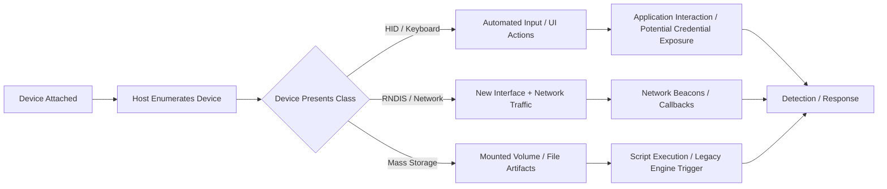

# BadUSB Attacks — Overview, Research & Defensive Guidance

> **Audience & intent:** This page explains the **concepts, architecture, and defensive implications** of BadUSB-style proof-of-concepts. It avoids step-by-step instructions and executable payloads. Always test only in isolated, authorized labs.

---

## Executive summary

BadUSB attacks abuse the trust operating systems place in USB peripherals by presenting attacker-controlled capabilities (HID/keyboard, network, storage, etc.). The PoCs collected here illustrate common impact vectors — UI automation and credential risk, rapid hardware-triggered post-exploitation, and legacy scripting triggers. These artifacts are research-focused and intended to inform detection, purple-team exercises, and defensive hardening.

**PoC list (overview):** a curated list of BadUSB-related PoCs and demonstrations: https://github.com/stars/GamehunterKaan/lists/badusb-pocs

---

## What is a BadUSB attack? (high level)

- **Conceptual definition:** A BadUSB attack uses a USB device’s programmable interfaces to cause a host to perform unintended actions. Because USB devices are auto-enumerated and often trusted, a malicious peripheral can masquerade as normal hardware while performing harmful operations.  
- **Why it matters:** USB is widely available and frequently physically accessible. Unmediated device capabilities (keyboard input, new network interfaces, mounted volumes) create an attack surface with real consequences for endpoints and networks.

---

## Threat model & attacker capabilities (non-actionable)

- **Physical access requirement:** Many BadUSB scenarios require physical or proxied physical access (dropped devices, swapped peripherals, or compromised supply chains).  
- **Device impersonation:** Attackers can present HID (keyboard), RNDIS (network), or mass-storage device classes, each with distinct defensive challenges.  
- **Fast automation vs. persistence:** Attacks can be short-lived automated triggers or attempts to establish persistence by chaining into post-exploitation tooling.  
- **Defensive baseline assumption:** Treat unknown USB devices as potentially malicious and instrument system telemetry accordingly.

---

## High-level architecture & common components (conceptual)

Most BadUSB PoCs share these conceptual components:

- **Device emulator / trigger** — the peripheral identifies itself as one or more USB device classes (HID, RNDIS, storage). This is the core attack surface.  
- **Payload artifact** — scripted or artifact files that cause host actions when the device is accepted by the OS (documented at repo level for research).  
- **Automation sequence** — simulated keystrokes, automatic mounts, or interface negotiation sequences that cause a target action on the host.  
- **Chaining & hooks** — mechanisms that hand off from initial trigger to longer-lived post-exploitation workflows in controlled lab scenarios.

Focus on **behavioral patterns** (attach → rapid UI automation, new interface → network traffic, mounted volume → script invocation) rather than implementation details.

---

## Conceptual flow (non-actionable)

---

## Per-project conceptual summaries

> **Note:** The summaries below are high-level and defensive in nature. Consult each repo’s README for project context and lab documentation.

### BadUSB-Browser — browser-focused UI automation & credential risk

**Concept:** Demonstrates how an input-emulating device can automate browser interactions (open pages, navigate, submit forms) that could lead to credential exposure when combined with malicious landing pages or social engineering.
**Research value:** Highlights detection points around rapid GUI automation and unusual browser activity following device attach.
**Repo:** `github.com/GamehunterKaan/BadUSB-Browser`

---

### BadUSB-Meterpreter — hardware-triggered chaining to post-exploitation tooling

**Concept:** Shows how a quick hardware-trigger can hand off to post-exploitation frameworks, reducing an attacker’s time-to-breach in a lab scenario.
**Research value:** Useful for measuring telemetry gaps between attach events and remote sessions and for developing early-warning detections.
**Repo:** `github.com/GamehunterKaan/BadUSB-Meterpreter`

---

### VBSBadUSB — legacy scripting as a trigger vector

**Concept:** Uses lightweight legacy scripting (VBScript) as a practical demonstration that older interpreters can still be abused when invoked by peripheral-driven actions.
**Research value:** Reinforces the need to inventory and control legacy scripting engines and to monitor their invocation patterns.
**Repo:** `github.com/GamehunterKaan/VBSBadUSB`

---

## Detection hypotheses & SOC playbook snippets (conceptual)

Translate these hypotheses into telemetry rules and test them in controlled labs:

1. **Attach-to-Action Spike:** New HID or USB network interface enumerated and, within a short window, one or more user processes exhibit automated UI actions or unexpected network requests → investigate.
2. **Unexpected Scripting Activity:** Script interpreter processes (legacy or modern) start in user context shortly after a device attach event → correlate and alert.
3. **Rapid Browser Automation:** Browser performs scripted navigations/form submissions without explicit user gestures → correlate with device attach.
4. **New Interface + Egress:** New network interface (e.g., RNDIS) appears and outbound connections to unfamiliar domains commence → high-priority investigation.

**SOC playbook snippets (conceptual, non-prescriptive):**

* Collect attach-time events (USB device IDs, class types, driver loads).
* Correlate attach events with process creation and network flows in a 30–120 second window.
* If attach correlates with anomalous automation or egress, isolate host and preserve telemetry for analysis.

---

## Defensive controls & recommendations

**Administrative & policy controls**

* Implement and enforce a strict USB usage policy in sensitive environments.
* Limit physical access and train staff to refuse unknown devices.
* Consider device allowlists and procurement controls for peripherals.

**Endpoint hardening**

* Block or restrict unnecessary USB device classes (HID, RNDIS) via device control policies.
* Harden applications (browsers, document viewers) to avoid auto-triggered behaviors.
* Remove or restrict legacy scripting interpreters where possible.

**Monitoring & detection**

* Log device attach events and driver loads. Correlate with process and network telemetry.
* Create alerts for attach-followed-by-process-activity or attach-followed-by-new-network-interface patterns.
* Monitor for rapid GUI automation sequences and unexpected script engine usage.

**Network & containment**

* Enforce strict egress controls and network segmentation to limit attacker callback opportunities.
* Alert on immediate outbound connections from endpoints exhibiting attach-time anomalies.

---

## Safe lab setup & ethics checklist

* Test only in isolated lab environments with no production connectivity.
* Obtain explicit authorization and document scope, objectives, and rollback steps.
* Publish PoCs accompanied by defensive guidance and safe-testing checklists.
* Coordinate disclosure if research affects third-party products.

---

## How defenders can use these PoCs

* **Threat modeling:** Understand plausible peripheral-driven attack vectors for your environment.
* **Detection development:** Derive behavior-based detections from PoC patterns (attach → activity → egress).
* **Purple-team exercises:** Measure detection efficacy and adjust playbooks with controlled adversary emulation.
* **Training & awareness:** Use sanitized artifacts and screenshots to educate analysts and end-users.

---

## Recommended references

* Curated BadUSB PoCs list: [https://github.com/stars/GamehunterKaan/lists/badusb-pocs](https://github.com/stars/GamehunterKaan/lists/badusb-pocs)
* Individual PoCs (examples):

  * `https://github.com/GamehunterKaan/BadUSB-Browser`
  * `https://github.com/GamehunterKaan/BadUSB-Meterpreter`
  * `https://github.com/GamehunterKaan/VBSBadUSB`

Search for vendor advisories and peer-reviewed papers for deeper academic background on USB device security and HID/RNDIS threats.

---

## Closing notes

BadUSB research surfaces detection gaps and informs practical defenses. The goal of these PoCs is to help defenders build resilient telemetry, refine response playbooks, and raise organizational awareness. If desired, this page can be extended with non-actionable diagrams (PNG/SVG) for SOC training, a detection-rule template (pseudocode/logic only), or a research-report template to include in each repository’s README.

